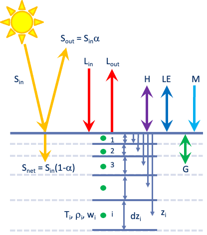

# IMAU-pyEBM
**The IMAU Python SEB model for snow and ice**




### Python installation
See [Anaconda Installation](https://docs.anaconda.com/anaconda/) to install Anaconda. Then, [verify your installation](https://docs.anaconda.com/anaconda/install/verify-install/).


Open a terminal (macOS) or an anaconda prompt (Windows):
* Windows: Start -> search “Anaconda Prompt”
* macOS: Launchpad -> Terminal

Create a new conda environment named "sebmodel" with python installed, and activate it:
```bash
conda create -n sebmodel python
conda activate sebmodel
```
Note that Python version 3.9.2 might be required for compatilibity with the numba package (on March 2022).

Install the required Python packages:

```bash
conda install pandas distributed xarray numba bottleneck netcdf4 dask distributed dask-jobqueue
```
This can take a few minutes.

### Download the SEB model
In the terminal, navigate to a directory _INSTALLDIR_ of your choice.
```bash
cd INSTALLDIR
```

* For developpers (using git), clone the repository.
  In the terminal, run:
  ```bash
  git clone https://github.com/IMAU-ice-and-climate/IMAU-pyEBM.git
  ```

* For users, download the [.zip file](https://github.com/IMAU-ice-and-climate/IMAU-pyEBM/releases/) and unzip in _INSTALLDIR_

### Preparing forcing and parameter files
Make sure that you have the following directory structure :
```
seb-model_python-main
├── input
│   ├── ant_aws14
│   │   ├── ant_aws14_ebm.py
│   │   ├── ant_aws14_HOUR-EBM.txt
│   ├── grl_2Dtest
│   │   ├── grl_2Dtest.py
│   │   ├── grl_2Dtest_HOUR-EBM.nc
├── output
│   ├── ant_aws14
│   ├── grl_2Dtest
├── sebmodel
```
In the 'input' directory, there should be one folder per station. 
In each station folder, there should be 2 files:

* awsid_ebm.py: parameters

* awsid_HOUR-EBM.txt (1D) or awsid_HOUR-EBM.nc (2D): atmospheric forcing 

Each of these files needs to be in a very specific format for the SEB model to run.

### Running the SEB model from the terminal
Go to the sebmodel directory

```bash
cd sebmodel/
```

Run the preparation script:
```bash
python sebmodel_pre.py --aws ant_aws07 --v 1D 
```
You can change the name of the station (aws_ant07) and the type of version (1D or 2D).
This script doe snothing more than copy the parameter file awsid_ebm.py from the input folder to the info.py file in the source code directory. 


Now, run the SEB model:
```bash
python sebmodel.py
```

If everything works, you should see the something like:


```bash
(sebmodel) UU-CQ0WFQCMYW:sebmodel Tigge006$ python sebmodel_pre.py --aws ant_aws14 --v 1D
chstation is  ant_aws14
version is  1D
convert info file is  False
(sebmodel) UU-CQ0WFQCMYW:sebmodel Tigge006$ python sebmodel.py 
AWS is =  ant_aws14
/Users/Tigge006/surfdrive/04_Scripts/SEB_model/IMAU-pyEBM/sebmodel

 Maximum available time interval from 2009-01-21T22:00 until 2022-11-27T23:00. Time steps: 121394 


--------------------------------------------------------------
Checking input FORCING .... 

Temperature FORCING (T) present
Specific humidity FORCING (q) present
Incoming hortwave FORCING (Sin) present
Outgoing shortwave FORCING (Sout) present
Wind velocity FORCING (WS) present
Precipitation FORCING (precip) present
WARNING Precip in input out of range MAX: 74.64 MIN: 0.00 

Pressure FORCING (P) present
Albedo FORCING (alb) present
Incoming longwave FORCING (Lin) present
Outgoing longwave FORCING (Lout) present
Serie FORCING (Serie) present
Aerodynamic roughness FORCING (z0m) present
Height of T-q sensor FORCING (zt) present
Height of WS sensor FORCING (zm) present


Output dataset ... ok
Starting initgrid
initial number of layers is:  29 29 1.6104124773293442 8.84747999408851 1
Starting initsnow
Starting initgrains
Starting get_errorflag
Starting checkdata
END data checking, start EBM calculation
1 resizegrid 28 0 -4.630686355675629 -2.3153431778378146 -1490.3394073517702 321.83985113246257
REDEFGRID: added layer at bottom 34 2.0 7.7508149209270645 5.501610087699024 4.749199894689264 0.5016199647765767 2 576.0305129737757
0 % done
2 % done
.
.
.
97 % done
99 % done
	 Time required to do calculations:    0 minutes 10.6027 seconds 


--------------------------------------------------------------
Write results ...
-------------------------------------------------------------- 

	 Time required tor write restart and output files:    0 minutes 10.0734 seconds 

	 Total run duration:    0 minutes 20.6799 seconds 

--------------------------------------------------------------
	 SIMULATION WAS SUCCESSFUL
--------------------------------------------------------------

```

The output files are written in the 'output' folder:

```
seb-model_python-main
├── input
│   ├── ant_aws14
│   │   ├── ant_aws14_ebm.py
│   │   ├── ant_aws14_HOUR-EBM.txt
├── output
│   ├── ant_aws14
│   │   ├── ant_aws14_ALL.nc
│   │   ├── ant_aws14_DAY.nc
│   │   ├── ant_aws14_MONTH.nc
│   │   ├── ant_aws14_SEAS.nc
│   │   ├── ant_aws14_YEAR.nc
├── sebmodel
```
The raw (hourly or 30min) output is stored in the 'ant_aws14_ALL.nc' file. 

The other files contain the same variables but averaged per day, month, seasonnaly or yearly. 

### Opening the output data

The output file are in netCDF format. They can be opened using the 'xarray' module in python.

For instance, make a new .py file which contains something like this:

```python 

import xarray as xr

file = 'IMAU-pyEBM/output/ant_aws14/ant_aws14_ALL.nc' # change this !
ds = xr.open_dataset(file)
ds['melt'].plot()

```

### References
* Greuell, W., & Konzelmann, T. (1994). Numerical modelling of the energy balance and the englacial temperature of the Greenland Ice Sheet. Calculations for the ETH-Camp location (West Greenland, 1155 m a.s.l.). Global and Planetary Change, 9(1–2), 91–114. https://doi.org/10.1016/0921-8181(94)90010-8
* Van den Broeke, M. R. (1996). Characteristics of the lower ablation zone of the West Greenland ice sheet for energy-balance modelling. Annals of Glaciology, 23, 7–13. https://doi.org/10.3189/s0260305500013392
* Reijmer, C. H., & Oerlemans, J. (2002). Temporal and spatial variability of the surface energy balance in Dronning Maud Land, East Antarctica. Journal of Geophysical Research Atmospheres, 107(24), ACL 9-1-ACL 9-12. https://doi.org/10.1029/2000JD000110
* Reijmer, C. H., & Hock, R. (2008). Internal accumulation on storglaciären, Sweden, in a multi-layer snow model coupled to a distributed energy- and mass-balance model. Journal of Glaciology, 54(184), 61–72. https://doi.org/10.3189/002214308784409161
* Kuipers Munneke, P., Van Den Broeke, M. R., King, J. C., Gray, T., & Reijmer, C. H. (2012). Near-surface climate and surface energy budget of Larsen C ice shelf, Antarctic Peninsula. Cryosphere, 6(2), 353–363. https://doi.org/10.5194/tc-6-353-2012
* Kuipers Munneke, P., Smeets, C. J. P. P., Reijmer, C. H., Oerlemans, J., van de Wal, R. S. W., & van den Broeke, M. R. (2018). The K-transect on the western Greenland Ice Sheet: Surface energy balance (2003–2016). Arctic, Antarctic, and Alpine Research, 50(1), S100003. https://doi.org/10.1080/15230430.2017.1420952
* Jakobs, C. L., Reijmer, C. H., Kuipers Munneke, P., König-Langlo, G., & Van Den Broeke, M. R. (2019). Quantifying the snowmelt-albedo feedback at Neumayer Station, East Antarctica. Cryosphere, 13(5), 1473–1485. https://doi.org/10.5194/tc-13-1473-2019
* Jakobs, C. L., Reijmer, C. H., Smeets, C. J. P. P., Trusel, L. D., Van De Berg, W. J., Van Den Broeke, M. R., & Van Wessem, J. M. (2020). A benchmark dataset of in situ Antarctic surface melt rates and energy balance. Journal of Glaciology, 66(256), 291–302. https://doi.org/10.1017/jog.2020.6
* Huai, B., van Den Broeke, M. R., & Reijmer, C. H. (2020). Long-term surface energy balance of the western Greenland Ice Sheet and the role of large-scale circulation variability. Cryosphere, 14(11), 4181–4199. https://doi.org/10.5194/tc-14-4181-2020
* Van Tiggelen, M., Smeets, P. C. J. P., Reijmer, C. H., van den Broeke, M. R., van As, D., Box, J. E., & Fausto, R. S. (2023). Observed and Parameterized Roughness Lengths for Momentum and Heat Over Rough Ice Surfaces. Journal of Geophysical Research: Atmospheres, 128(2). https://doi.org/10.1029/2022JD036970
* Van Tiggelen, M., Smeets, P. C. J. P., Reijmer, C. H., Van As, D., Box, J. E., Fausto, R. S., Khan, S. A., Rignot, E., & Van Den Broeke, M. R. (2024). Surface energy balance closure over melting snow and ice from in situ measurements on the Greenland ice sheet. Journal of Glaciology. https://doi.org/10.1017/jog.2024.68

### AWS forcing data
* Smeets, Paul C J P; van den Broeke, Michiel R; Boot, Wim; Cover, Giorgio; Eijkelboom, Mark; Greuell, Wouter; Tijm-Reijmer, Carleen H; Snellen, Henk; van de Wal, Roderik S W (2022): Automatic weather station data collected from 2003 to 2021 at the Greenland ice sheet along the K-transect, West-Greenland [dataset publication series]. PANGAEA, https://doi.org/10.1594/PANGAEA.947483
* Van Tiggelen, Maurice; Smeets, Paul C J P; Tijm-Reijmer, Carleen H; Miège, Clement; Forster, Richard R; Khan, Shfaqat Abbas; Rignot, Eric; van den Broeke, Michiel R (2024): Hourly automatic weather station data collected on Zachariae Isstrøm, Northeast-Greenland (2016-2020) and at a Firn Aquifer site, East Greenland (2014-2017) [dataset bundled publication]. PANGAEA, https://doi.org/10.1594/PANGAEA.971647
* How, P.; Abermann, J.; Ahlstrøm, A.P.; Andersen, S.B.; Box, J. E.; Citterio, M.; Colgan, W.T.; Fausto. R.S.; Karlsson, N.B.; Jakobsen, J.; Langley, K.; Larsen, S.H.; Lund, M.C.; Mankoff, K.D.; Pedersen, A.Ø.; Rutishauser, A.; Shield, C.L.; Solgaard, A.M.; van As, D.; Vandecrux, B.; Wright, P.J., 2022, "PROMICE and GC-Net automated weather station data in Greenland", https://doi.org/10.22008/FK2/IW73UU, GEUS Dataverse, V19


### Additionnal information

For similar SEB models, please check:

* COSIPY: https://github.com/cryotools/cosipy
* CryoGrid Community model: https://github.com/CryoGrid/CryoGridCommunity_source
* EB_AUTO Spreadsheet Energy Balance Model: https://github.com/atedstone/ebmodel
* Distributed Energy Balance Model : https://github.com/regine/meltmodel
* GEUS Surface Energy Balance and Firn Model: https://github.com/BaptisteVandecrux/SEB_Firn_model
* SNOWPACK: https://code.wsl.ch/snow-models/snowpack
* CROCUS: https://www.umr-cnrm.fr/spip.php?article265&lang=en

If you have any questions, feel free to contact Maurice van Tiggelen, m.vantiggelen[@]uu.nl 